# cymoo

## Set up the project

```bash
python3 -m venv venv
source venv/bin/activate
pip install --upgrade pip
pip install -r requirements.txt
```

## Run the project

```bash
source venv/bin/activate
python src/main.py
```

## Diagrams
### Class

```mermaid
classDiagram
    class MOO{
        Problem problem
        Optimizer optimizer
        int nSolutions
        int minDepth
        int maxDepth
        optimize(nIter, **kwargs)
    }

    class NSGA2{
        Problem problem
        int nSolutions
        int minDepth
        int maxDepth
        ranking()
        crowding_distance()
        selection(ratioKept)
        offspring_generation()
        optimize(ratioKept)
    }

    class Solution{
        [maxId]
        int id
        tuple solution
        list parameters
        int rank
        float crowdingDistance
    }

    class Task{
        int nInstructions
        int dataSize
    }

    class Cable{
        Unit from
        Unit to
        get_other_unit(Unit unit)
        to_neo4J()
    }

    class Network{
        str startTag
        Task task
        list optimDirections
        float mutationRate
        generate_parameters(Object expression, Object *parameters)
        generate_basic_network(list[dict] parameters)
        populate(int nSolutions, int minDepth, int maxDepth)
        crossover(Path path_1, Path path_2)
        mutate(Solution solution)
        generate_path(int maxDepth)
        to_neo4j()
    }

    class Path{
        list[Unit] units
        list[Cable] cables
        add_unit(Unit unit)
        add_cable(Cable cable)
        create_path(list[Unit] units, list[Cable] cables)
        to_solution(Task task, int id=None)
        compute_solution(Task task)
        compute_time(Task task)
        compute_cost(Task task)
        compute_pollution(Task task)
    }

    class Unit{
        str id
        str tag="UNIT"
        connect(Cable cable)
        to_neo4j()
    }

    class Neo4jConnector{
        close()
        run(int execution, str query)
        static_method(Neo4jTransactionObject tx, str query)
        gen_static_method(str query)
    }
```

