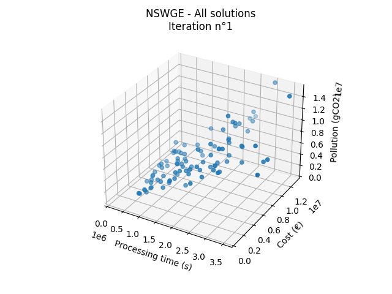

# cymoo
`cymoo` is a simple and generic package for multi-objective optimization.
<p align="center">
    
</p>

## Development version
Only [UNIX](https://en.wikipedia.org/wiki/Unix) systems are officially supported.

### Requirements
```bash
git python
```

### Installation
Complete setup of the project
```bash
# clone source files
git clone https://github.com/alexisjapas/cymoo.git

# move to the project folder
cd cymoo

# setup environment
make
```

Activate environment
```bash
source venv/bin/activate
```

### Usage
Run an optimization example
```bash
source venv/bin/activate
python src/main.py
```

## Project structure


## Code of Conduct
`cymoo` has a [Code of Conduct](CODE_OF_CONDUCT.md) that should be honored by everyone who participates in the `cymoo` community.

## Contributing
Contributions are encouraged! Please read our [Contributing Guide](CONTRIBUTING.md) to get started.

## License
[GNU General Public License v3.0](LICENSE)
